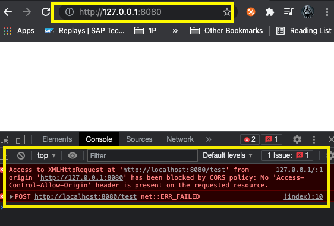
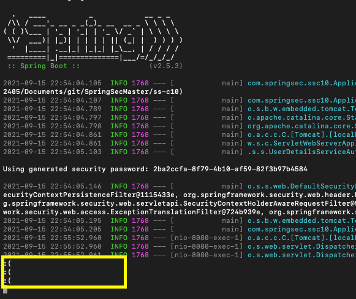

# Chapter 10

## Learn about CORS
* CORS is a feature by which a browser does not receive the response from a resource which is not belonging to the same origin 
* CORS does not stop the nrowser from firing the call, it stops from receiving the response
* applications need to secure the methods so that it does not receive unwanted calls 

## Backgorund

## What we do in this demo 
* We try to load `http://localhost:8080/` in the browser. This page is internally firing a POST call to another resource `http://localhost:8080/test`. Since both are from the same origin `localhost:8080` all works fine till here. 

* But when we change the Browser url to 
`http://127.0.0.1:8080/` it gives CORS issue while trying to access `http://localhost:8080/test`. However in the hanlder of `test` method we see the call to come ( verified via log message ). This is not expected from application side. We shall learn how to mitigate this. 


## Securing methods from being invoked 
### Approach 1 : Specify `@CrossOrigin` annotation at method level

By specifying the supported origins at the handler level 
````java
    @PostMapping("/test")
	@ResponseBody
	@CrossOrigin("*") // we can pass allowable origins http:localhost://, or simpley * 
	public String test() {
		System.out.println(":(");
		return "TEST!" ;
	}
````

This annotation will produce followinh HTTP response header
`Access-Control-Allow-Origin = *` , and browser will allow the response .

**Drawback** 
<br>In productive application we can not spaecify the URL ( because it is dynamic) on which we URLs we want to allow the calls 
````java 
@CrossOrigin("http://localhost:8080/..")
````


### Approach 2 


## Note
* Good to Know : we are using @RestController and @Controller in this example. The @Controller annotation returns the thymeleaf template 

@Controller + @Responsebody = @RestController 
* CORS issue does not stop the browser to call the url ; we can see the debug logs coming from MvcController->test(). But the browser does not receive teh response .
So  it is risky for Mutating operation , it does. not protect the data from duplicate mutation . But in browser there is not resonse 




CORS is different from CSRF; where CSRF does not allow the the request to come to themethod; CORS leaves it to the decision of the browser. So it is needed to protect the methods from CORS issue with additional issue. 