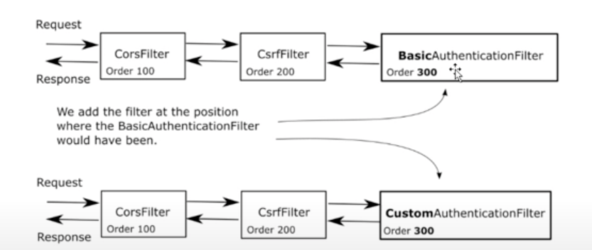

# Chapter 5
 
## Learn about _Custom_ `AuthenticationFilter` 

## Background 
<br>

<br>
The above picture explains certain important concepts. The flow describes the interactions between different SpringBoot compoenents starting from  Authentication Filter.


1.  `AuthenticationFilter` is a central SpringBoot component of type `Filter`. It is one of the filters in the `filterChain`. This filter intercepts the HTTP requests to the applicatin and activates necessery steps to authenticate the user by delegating the call to a `AuthenticationManager`.
2. `AuthenticationManager` interface only one method `authenticate` , which is the olny expectation from the `AuthenticationFilter`'s side .

````java
public interface AuthenticationManager {
Authentication authenticate(Authentication authentication) throws AuthenticationException;
}
````
However the `AuthenticationManager` does not know how to authenticate. The logic for Authentication can be diverse an complex. A credential based authentication is difefrent from a token based authentication. This logic is known to `AuthenticationProvider`. So a `AuthenticationManager` _**finds**_  and _**delegates**_ the resposibility of _authentication_ to a suitable `AuthenticationProvider` 

3. `AuthenticationProvider` knows how to authenticate _**for a given type**_ of `Authentication`. 

The interface looks like this
````java
public interface AuthenticationProvider {
	Authentication authenticate(Authentication authentication) throws AuthenticationException;
	boolean supports(Class<?> authentication);
}
````

* `supports`  this method answers if a _**specific**_ `Authentication` type can be authenticated by the current `AuthenticationProvider`
* `authenticate` this is where the actual authentication happen.It owns the logic to authenticate for a specific authentication type. For Example: If the authentication type is Basic Authentication , then thsi method verifies the user credentials 

4. `UserDetailsService` and `PasswordEncoder` relevant for Credential based authentication ..[ _here in the example we are not using this type of authenticatication, hence represented by dotted line in the picture ._]
5. `SecurityContext` holds the successful authentication information to be used further by the application whenever needed. 


<br>
The above picture represents the `FilterChain` flow; there can be multiple filters in a filter chain each of them addressing a specific responsibility. AuthenticationFilter is one of such filters. 

The filters in the filterchain are called in specific order . It is possible to introduce custom filter at specific position in the filter chain .


In this example we shall replace the BasicAuthenticationFilter with CustomAuthenticationFilter


## What we do in this demo 
* We want to authenticate a user in our app if someone passes `abcde` in `authorization` header.
* As this is not a standard authentication flow , We want to configure a `CustomFilter` for our application  which will enable us to do it. 

## How 


### Introduce a _Custom_ `Authentication` type 

### Introduce  _Custom_ `AuthenticationProvider` which can Authenticate the _Custom_`Authentication`

### Introduce a custom `AuthenticationFilter` 

### Configure Customfilter in your application's `filterChain`

### Make the `CustomAuthenticationProvider` available to the Spring Bean context 


# Reference 
https://www.youtube.com/watch?v=EeXFwR21J1A&list=PLEocw3gLFc8XRaRBZkhBEZ_R3tmvfkWZz&index=5


