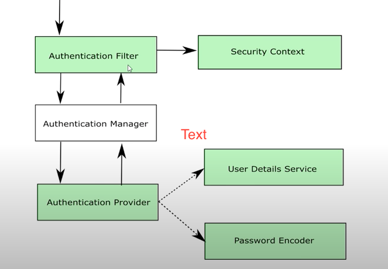
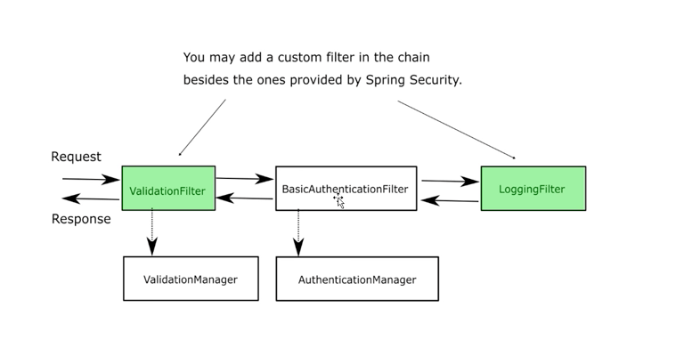

# Chapter 4
 
## Topic : Customfilter 

## 
we need to setup the CustomAuthenticationProvider using `AuthenticationManagerBuilder`

## What we do in this demo 
* We want to configure a `CustomFilter` for our application  

## How 

### Introduce a `CustomFilter` 

### Introduce a `CustomAuthentication` type 

### Introduce  `CustomAuthenticationProvider` which can Authenticate the `CustomAuthentication`

### Configure Customfilter in your application's `filterChain`

### Make the `CustomAuthenticationProvider` available to the Spring Bean context 

